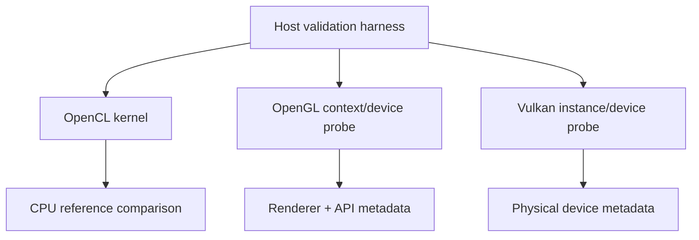

# GPU API Validation Lab — OpenCL · OpenGL · Vulkan

A small systems lab for validating GPU compute/graphics API availability and executing a real OpenCL kernel. It keeps the three API families in one repo so their initialization and device-discovery paths are easy to compare.

## What it demonstrates

- OpenCL platform/device discovery
- OpenCL vector-add kernel compilation and execution
- CPU-side result validation
- OpenGL context creation with GLFW + renderer/version inspection
- Vulkan instance creation + physical-device enumeration
- CMake feature detection for all three APIs
- Pytest numerical validators for backend comparisons

## Build

```bash
cmake -S gpu -B gpu/build
cmake --build gpu/build -j
```

Run whichever backends are available:

```bash
./gpu/build/opencl_vector_add
./gpu/build/opengl_probe
./gpu/build/vulkan_probe
```

## Architecture



## Why this is useful

CUDA is NVIDIA-specific; OpenCL, OpenGL, and Vulkan expose different portability/graphics layers. This project makes the initialization and device model differences concrete while keeping result validation explicit.

## Resume-safe description

Built a cross-API GPU validation lab with OpenCL kernel execution and numerical checking, OpenGL context/renderer inspection, and Vulkan physical-device enumeration using CMake-based feature detection.

## Python validation utilities

The original NumPy validation helpers remain under `validators.py` and `tests/`.

## License

MIT
